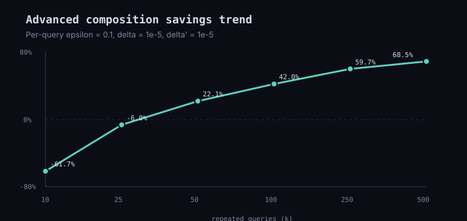

# Differential Privacy Library Demo

[](https://github.com/mn3040/differential-privacy/actions/workflows/tests.yml)

Most differential privacy libraries hide the math behind abstractions. I
wanted to understand how the algorithms actually work, so I built every
mechanism from scratch.

This project implements the Laplace, Gaussian, and Exponential
mechanisms in Python, lets you run queries against real datasets, and
includes an interactive web demo, privacy budget calculators, and
sensitivity comparisons. Every equation is readable, testable, and easy
to experiment with. The goal isn't to replace production libraries like
OpenDP. The goal is to help you understand how differential privacy
works.

**Try it live:** https://mn3040.github.io/differential-privacy/

## Features

-   Build and explore the Laplace, Gaussian, and Exponential mechanisms
    from scratch.
-   Run count, sum, mean, and categorical queries on bundled datasets.
-   Compare global and local sensitivity.
-   Explore sequential and advanced privacy budget composition.
-   Use the project from the command line or in your browser.
-   Read and test every formula without relying on external differential
    privacy libraries.

## Why I Built This

Most differential privacy libraries are designed for production systems.
They hide the implementation details behind clean APIs.

I wanted to understand the algorithms instead of treating them like a
black box. This project focuses on readability, experimentation, and
learning. Every mechanism is implemented from scratch so you can follow
the math from start to finish.

## Datasets

| key | rows | what's in it | source |
|---|---:|---|---|
| `iris` (default) | 30 | 4 flower measurements + species | bundled excerpt of Fisher's Iris dataset |
| `pums` | 1000 | age, education, income, marital status | [opendp/dp-test-datasets](https://github.com/opendp/dp-test-datasets), `data/PUMS_california_demographics_1000` |

The PUMS sample is real (if dated and de-identified) California census
microdata, used as-is from OpenDP's own test fixtures. Numeric columns
are clipped to public bounds (`age` in `[18, 95]`, `educ` in `[0, 16]`,
`income` in `[0, 420500]`); the `married` column (`0`/`1` in the source
CSV) is relabeled to `married`/`unmarried` for the `mode_category`
query. That repository does not declare an explicit license, so treat
the CSV the same way OpenDP's own tutorials do: for testing and
teaching, not redistribution as a dataset in its own right.

## Run the CLI

```powershell
python -m dp_demo.cli --dataset iris --query mean --column petal_length --category setosa --mechanism laplace --epsilon 1 --seed 42
```

Run the same query against the PUMS sample instead:

```powershell
python -m dp_demo.cli --dataset pums --query mean --column income --mechanism laplace --epsilon 1 --seed 42
```

Gaussian requires a nonzero delta:

```powershell
python -m dp_demo.cli --dataset iris --query count --mechanism gaussian --epsilon 1 --delta 0.000001 --seed 42
```

Exponential picks a category instead of perturbing a number:

```powershell
python -m dp_demo.cli --dataset pums --query mode_category --mechanism exponential --epsilon 2 --seed 42
```

Total privacy spend across repeated queries:

```powershell
python -m dp_demo.cli compose --method advanced --k 100 --epsilon 0.1 --delta 1e-5 --delta-prime 1e-5
```

## Run the Web Demo

```powershell
python -m dp_demo.app --port 8765
```

Then open:

```text
http://127.0.0.1:8765
```

Switch datasets from the **Dataset** dropdown in the form --- the
column, category, and mode-category options update to match whichever
dataset is selected.

## GitHub Pages

[`docs/index.html`](docs/index.html) and [`docs/app.js`](docs/app.js)
are a self-contained, client-side reimplementation of the same
mechanisms, datasets, and query logic --- no Python backend, so it can
be hosted directly from GitHub Pages. It fetches the same CSVs from
`docs/data/` and runs every formula in the browser; nothing is sent to a
server.

To enable it for this repo: **Settings → Pages → Build and deployment →
Source: Deploy from a branch → Branch: `main`, folder: `/docs`**. Once
enabled, the site is served at `https://<username>.github.io/<repo>/`.

The JS port intentionally mirrors `dp_demo/mechanisms.py`, `dataset.py`,
and `queries.py` line-for-line where possible (see the comment at the
top of `app.js`) so the two stay easy to keep in sync.
`tests/test_js_parity.py` runs the same seeded Laplace, Gaussian, and
Exponential queries through both implementations and compares the
releases exactly, so drift between the Python package and static site
fails CI instead of living as a prose warning.

## The Definition Everything Else Is Built On

A randomized mechanism `M` satisfies `epsilon`-differential privacy if,
for every pair of neighboring datasets `D` and `D'` (differing in one
row) and every measurable output set `S`:

```text
Pr[M(D) in S] <= e^epsilon * Pr[M(D') in S]
```

Every mechanism below is just a different way of satisfying that
inequality. Smaller `epsilon` forces the two probabilities closer
together, i.e. the output reveals less about whether any single row was
included.

## What Is Implemented

### Laplace mechanism (`dp_demo/mechanisms.py`)

For a numeric query `f(D)` with L1 sensitivity `S`, the release is:

```text
f(D) + Laplace(0, S / epsilon)
```

This gives pure epsilon-DP when the sensitivity is correct.

### Gaussian mechanism (`dp_demo/mechanisms.py`)

For a numeric query `f(D)` with L2 sensitivity `S`, the release is:

```text
f(D) + Normal(0, sigma)
sigma = sqrt(2 ln(1.25 / delta)) * S / epsilon
```

This is the classic textbook calibration for approximate
`(epsilon, delta)`-DP.

### Exponential mechanism (`dp_demo/mechanisms.py`)

Laplace and Gaussian only make sense for numeric outputs --- there's no
way to add noise to "setosa". When the output is categorical (or noise
would just destroy the answer), the exponential mechanism instead
perturbs *which* candidate gets selected, weighted by a utility function
`u(D, r)`:

```text
Pr[M(D) = r] proportional to exp(epsilon * u(D, r) / (2 * sensitivity_u))
```

where `sensitivity_u` is the largest amount one changed row can move any
single candidate's utility. The demo uses this for
`--query mode_category`: utility is each category's row count,
sensitivity is `1` (one row changes one category's count by at most
one), and the result is always a real category value (a species name, or
`married`/`unmarried`) rather than a noisy number. The `/ 2` in the
exponent (rather than `/ 1` as in Laplace) accounts for one row being
able to swing two candidates' utilities apart at once --- see
`exponential_weights` for the implementation.

## Query Sensitivities

The demo supports `count`, `sum`, `mean`, and `mode_category`.

-   `count`: sensitivity is `1`.
-   `sum`: values are clipped to a public range, then sensitivity is the
    largest possible clipped magnitude.
-   `mean`: values are clipped to a public range, then
    replacement-neighbor sensitivity is `(upper - lower) / n`.
-   `mode_category`: sensitivity of the per-category count utility is
    `1`, released through the exponential mechanism instead of added
    noise.

## Global Vs. Local Sensitivity (`dp_demo/composition.py`)

All of the sensitivities above are *global*: the worst case over every
dataset that could ever be queried, not just the one actually loaded.
That's why the mean's sensitivity uses the public clipping bounds
`[lower, upper]` instead of the data's real min/max.

*Local* sensitivity instead measures the worst case for one specific
dataset `D`:

```text
global: LS_f      = max over all neighboring (D, D') of |f(D) - f(D')|
local:  LS_f(D)   = max over neighbors D' of D of |f(D) - f(D')|
```

Local sensitivity is never larger than global sensitivity, so
calibrating noise to it gives more accurate answers --- but it depends
on the dataset, so naively publishing a local-sensitivity-calibrated
result can itself leak information about the data. `composition.py`
exposes `global_sensitivity_mean` and `local_sensitivity_mean` side by
side purely for comparison; the actual `mean` query in `queries.py`
always calibrates to the global, public-bounds version.

## Composing Privacy Budget (`dp_demo/composition.py`)

Run two DP queries against the same data and you've spent two queries'
worth of privacy budget, not one. There are two ways to total that
spend:

**Sequential composition** --- exact, no assumptions, just adds up:

```text
epsilon_total = sum(epsilon_i)
delta_total   = sum(delta_i)
```

Three queries at `epsilon = 0.5, 0.3, 0.2` cost `epsilon_total = 1.0`.

**Advanced composition** --- a tighter, `sqrt(k)`-shaped bound for `k`
repeats of the *same* `(epsilon, delta)` mechanism, at the cost of an
extra failure probability `delta'`:

```text
epsilon_total = sqrt(2 k ln(1/delta')) * epsilon + k * epsilon^2
delta_total   = k * delta + delta'
```

For `k = 100` queries at `(epsilon = 0.1, delta = 1e-5)` with
`delta' = 1e-5`:

```text
sqrt(2 * 100 * ln(1e5)) * 0.1 = 4.7986
100 * 0.1^2                  = 1.0
epsilon_total                 ~= 5.8
```

Compare that to sequential composition's
`epsilon_total = 100 * 0.1 = 10.0` for the same 100 queries --- advanced
composition is the whole reason large query workloads (e.g. training a
model with many gradient steps) stay within a usable privacy budget
instead of blowing through it linearly.

That `42%` savings is not a one-off claim. `advanced_savings_sweep` checks
multiple `(k, epsilon)` combinations and records where advanced composition
helps, where it does not, and how the savings changes as repeated queries
grow. The full sweep is in
[`docs/data/composition_savings_sweep.csv`](docs/data/composition_savings_sweep.csv).



For `epsilon = 0.1`, the trend is:

| k | sequential epsilon | advanced epsilon | savings |
|---:|---:|---:|---:|
| 10 | 1.0 | 1.6174 | -61.7% |
| 25 | 2.5 | 2.6493 | -6.0% |
| 50 | 5.0 | 3.8929 | 22.1% |
| 100 | 10.0 | 5.7985 | 42.0% |
| 250 | 25.0 | 10.0871 | 59.7% |
| 500 | 50.0 | 15.7298 | 68.5% |

| | Sequential | Advanced |
|---|---|---|
| Formula | `sum(epsilon_i)` | `sqrt(2k ln(1/delta')) * epsilon + k * epsilon^2` |
| Assumptions | None | Same `(epsilon, delta)` repeated `k` times |
| Failure probability | Exact, `delta = 0` unless mechanisms use one | Adds slack `delta'` |
| Scaling with `k` | Linear | Roughly `sqrt(k)` |
| When to use | Few queries, or mixed mechanisms | Many repeats of one mechanism |

Advanced composition is not free. It only applies cleanly when the same
`(epsilon, delta)` guarantee is repeated `k` times, the mechanisms are run
through the composition theorem's assumptions, and you are willing to spend
the extra failure probability `delta'`. For small `k`, it can be worse than
plain sequential composition, as the negative savings rows above show. In a
production system, you would usually use a mature accountant such as RDP,
zCDP, or PLD accounting rather than this textbook bound.

For production systems, use a mature library such as OpenDP or Google
Differential Privacy --- both implement much tighter composition (Renyi
DP, zCDP) than either bound here. This project is deliberately small so
the mechanism and composition math are easy to inspect and test.

## Tests

```powershell
python -m unittest discover
```

`tests/test_mechanisms.py` covers Laplace, Gaussian, and Exponential
calibration; `tests/test_queries.py` covers per-query sensitivity
choices, including `mode_category`; `tests/test_composition.py` covers
the sequential/advanced composition formulas and the global-vs-local
sensitivity comparison.

## OpenDP Validation

The project intentionally implements the mechanisms from scratch, but it also
includes an optional trusted-reference check against OpenDP. Install OpenDP in
the Python environment you are using, then run:

```powershell
python -m pip install opendp
python scripts/validate_against_opendp.py
```

The script runs the same Iris `petal_width` sum query through this demo's
Laplace/Gaussian releases and OpenDP's `make_laplace` / `make_gaussian`
measurements using the same calibrated scale. It reports empirical means and
standard deviations for both implementations and fails if either implementation
drifts too far from the shared theoretical distribution moments. The unit test
`tests/test_opendp_validation.py` skips when OpenDP is not installed, so the
core demo stays dependency-light while still supporting a stronger validation
path.

## Learn By Experimenting

See [docs/learning_path.md](docs/learning_path.md) for a guided sequence
of queries that explains sensitivity, epsilon, delta, mechanism
calibration, the exponential mechanism, and budget composition.

## References

The framing of the six core equations above follows Abhishek Tiwari,
["Differential Privacy: 6 Key Equations
Explained"](https://doi.org/10.59350/ntarj-tg210) (2024).

## License

MIT. See [LICENSE](LICENSE).
